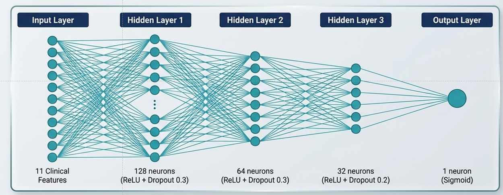

# ❤️ Heart Failure Prediction System

Advanced ML Model for Heart Disease Risk Assessment using supervised machine learning classification.

## 📋 Project Overview

**Objective:** Predict heart failure risk using clinical features and machine learning.

- **Type:** Binary Classification (Heart Failure Present/Absent)
- **Dataset:** 918 patients with 11 clinical features
- **Best Model:** Random Forest with GridSearchCV optimization
- **Performance:** 87.5% accuracy, 92.5% ROC-AUC
- **Deployment:** Interactive Streamlit web application

## 🚀 Live Application

**Try it now:** [Heart Failure Prediction System](https://heart-failure-prediction-mlcourse2025-2026.streamlit.app/)

## 📁 Repository Contents

**Core Project Files:**
- `ML_Analysis_Final_ver_2_0.ipynb` - Complete ML analysis & documentation
- `ML_Analysis_Final_ver_2_0.pdf` - Detailed project report
- `ML_Analysis_Final_ver_2_0.tex` - LaTeX source for PDF
- `app.py` - Streamlit web application for predictions
- `heart.csv` - Heart disease dataset (918 samples, 11 features)
- `requirements.txt` - Python dependencies

**Trained Models & Preprocessing:**
- `best_model.pkl` - Trained Random Forest model (1.7 MB)
- `scaler.pkl` - StandardScaler for feature normalization
- `label_encoders.pkl` - Categorical feature encoders
- `feature_names.pkl` - Feature names reference

**Data & Metrics:**
- `model_metrics.json` - Model performance metrics
- `patient_history.json` - Sample patient data
- `DATASET_ANALYSIS.md` - Dataset documentation

**Utility Scripts:**
- `ml_pipeline.py` - ML pipeline utilities
- `train_model.py` - Model training script
- `export_models.py` - Model export utilities
- `add_deep_learning.py` - Deep learning experimentation

## 🔧 Technologies Used

### Machine Learning & Data Science
- **NumPy** - Numerical computing
- **Pandas** - Data manipulation
- **Scikit-Learn** - ML algorithms & preprocessing
- **GridSearchCV** - Hyperparameter optimization
- **StratifiedKFold** - 5-fold cross-validation

### Visualization & Deployment
- **Matplotlib/Seaborn** - Static visualizations
- **Plotly** - Interactive charts
- **SHAP** - Model explainability
- **Streamlit** - Web application framework

### Tools & Environments
- **Python 3.x** - Primary language
- **Jupyter Notebook** - Analysis & documentation
- **Streamlit Cloud** - Live deployment
- **Git/GitHub** - Version control

## 📊 Model Performance

**🏆 Best Model: Random Forest (Tuned with GridSearchCV)**

| Metric | Score | Interpretation |
|--------|-------|-----------------|
| Test Accuracy | 87.5% | Excellent overall performance |
| ROC-AUC | 92.5% | Excellent discrimination |
| Recall | 91.18% | High disease detection rate |
| Precision | 86.92% | Low false positive rate |
| F1-Score | 89.0% | Balanced precision-recall |

**Models Evaluated:**
- ✅ **Random Forest** (Best) - 92.5% ROC-AUC
- Support Vector Machine (SVM) - Linear & RBF kernels
- Logistic Regression - Baseline statistical model
- Decision Tree - Tree-based classifier
- Deep Learning - Neural network experimentation (foundation laid)



## 🎯 Key Features

✅ **Real-time Predictions** - Instant risk assessment with clinical inputs

✅ **Model Explainability** - SHAP analysis shows feature importance

✅ **Patient History Tracking** - Save and analyze multiple predictions over time

✅ **Data Visualizations** - Interactive charts and trend analysis

✅ **Production-Ready Deployment** - Streamlit Cloud integration

## 📈 Dataset Information

- **Source:** [Heart Failure Prediction Dataset](https://www.kaggle.com/datasets/fedesoriano/heart-failure-prediction)
- **Samples:** 918 patients
- **Features:** 11 clinical measurements
- **Target:** Binary (0 = No disease, 1 = Heart failure)
- **Data Quality:** 100% complete, no missing values, balanced classes

## 🔬 Clinical Features

| Feature | Description |
|---------|-------------|
| Age | Patient age in years |
| Sex | Gender (M=Male, F=Female) |
| ChestPainType | Type of chest pain |
| RestingBP | Resting blood pressure (mmHg) |
| Cholesterol | Serum cholesterol level (mg/dL) |
| FastingBS | Fasting blood sugar > 120 mg/dL |
| RestingECG | Resting electrocardiogram results |
| MaxHR | Maximum heart rate achieved (bpm) |
| ExerciseAngina | Exercise-induced angina (Yes/No) |
| Oldpeak | ST depression induced by exercise |
| ST_Slope | Slope of ST segment |

## 🚀 Quick Start

### Prerequisites
```bash
pip install -r Final/requirements.txt
```

### Run the Webapp Locally
```bash
streamlit run Final/app.py
```

### View Analysis
Open `Final/ML_Analysis_Final_ver_2_0.ipynb` in Jupyter Notebook

## 📚 Course Information

- **Course:** Advanced ML & Data Analytics
- **Institution:** Nexa-land
- **Instructor:** Prof. Hamed Mamani, University of Washington
- **Semester:** 2026 Spring

## 👨‍💻 Author

**Mahdi Bakhtiari** (@mahdi-20)

- GitHub: [github.com/mahdi-20](https://github.com/mahdi-20)
- Email: mahdi6563@gmail.com

## ⚠️ Important Disclaimer

This application is for **educational purposes only** and should NOT be used for clinical diagnosis. Always consult with qualified healthcare professionals for medical advice and diagnosis.

The model predictions are estimates based on training data and should not replace professional medical evaluation.

## 📄 License

This project is part of an educational course. Use for learning purposes only.

---

**Last Updated:** April 21, 2026

Built with ❤️ using Python, Machine Learning, and Streamlit
